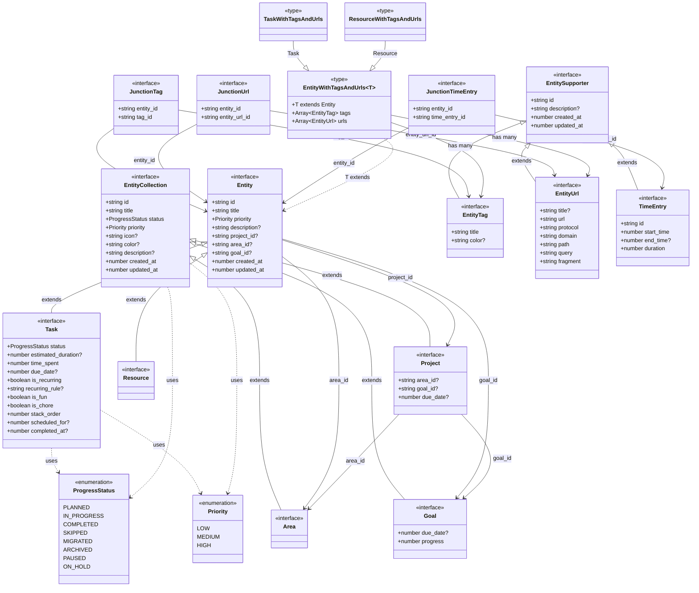

# unHussle Type System Overview

```mermaid
classDiagram
    %% Base Interfaces
    class EntitySupporter {
        <<interface>>
        +string id
        +string description?
        +number created_at
        +number updated_at
    }
    
    class Entity {
        <<interface>>
        +string id
        +string title
        +Priority priority
        +string description?
        +string project_id?
        +string area_id?
        +string goal_id?
        +number created_at
        +number updated_at
    }

    class EntityCollection {
        <<interface>>
        +string id
        +string title
        +ProgressStatus status
        +Priority priority
        +string icon?
        +string color?
        +string description?
        +number created_at
        +number updated_at
    }

    %% Entity Extensions
    class Task {
        <<interface>>
        +ProgressStatus status
        +number estimated_duration?
        +number time_spent
        +number due_date?
        +boolean is_recurring
        +string recurring_rule?
        +boolean is_fun
        +boolean is_chore
        +number stack_order
        +number scheduled_for?
        +number completed_at?
    }

    class Resource {
        <<interface>>
    }

    %% EntityCollection Extensions
    class Goal {
        <<interface>>
        +number due_date?
        +number progress
    }

    class Area {
        <<interface>>
    }

    class Project {
        <<interface>>
        +string area_id?
        +string goal_id?
        +number due_date?
    }

    %% EntitySupporter Extensions
    class EntityTag {
        <<interface>>
        +string title
        +string color?
    }

    class EntityUrl {
        <<interface>>
        +string title?
        +string url
        +string protocol
        +string domain
        +string path
        +string query
        +string fragment
    }

    class TimeEntry {
        <<interface>>
        +string id
        +number start_time
        +number end_time?
        +number duration
    }

    %% Join Tables
    class JunctionTag {
        <<interface>>
        +string entity_id
        +string tag_id
    }

    class JunctionTimeEntry {
        <<interface>>
        +string entity_id
        +string time_entry_id
    }

    class JunctionUrl {
        <<interface>>
        +string entity_id
        +string entity_url_id
    }

    %% Generic Types
    class EntityWithTagsAndUrls~T~ {
        <<type>>
        +T extends Entity
        +Array~EntityTag~ tags
        +Array~EntityUrl~ urls
    }

    class TaskWithTagsAndUrls {
        <<type>>
    }

    class ResourceWithTagsAndUrls {
        <<type>>
    }

    %% Enums
    class ProgressStatus {
        <<enumeration>>
        PLANNED
        IN_PROGRESS
        COMPLETED
        SKIPPED
        MIGRATED
        ARCHIVED
        PAUSED
        ON_HOLD
    }

    class Priority {
        <<enumeration>>
        LOW
        MEDIUM
        HIGH
    }

    %% Relationships
    Entity <|-- Task : extends
    Entity <|-- Resource : extends
    EntityCollection <|-- Goal : extends
    EntityCollection <|-- Area : extends
    EntityCollection <|-- Project : extends
    EntitySupporter <|-- EntityTag : extends
    EntitySupporter <|-- EntityUrl : extends
    EntitySupporter <|-- TimeEntry : extends

    Task ..> ProgressStatus : uses
    Task ..> Priority : uses
    EntityCollection ..> ProgressStatus : uses
    EntityCollection ..> Priority : uses

    Entity --> Project : project_id
    Entity --> Area : area_id
    Entity --> Goal : goal_id
    Project --> Area : area_id
    Project --> Goal : goal_id

    JunctionTag --> Entity : entity_id
    JunctionTag --> EntityTag : tag_id
    JunctionUrl --> Entity : entity_id
    JunctionUrl --> EntityUrl : entity_url_id
    JunctionTimeEntry --> Entity : entity_id
    JunctionTimeEntry --> TimeEntry : time_entry_id

    EntityWithTagsAndUrls~T~ ..> Entity : T extends
    EntityWithTagsAndUrls~T~ --> EntityTag : has many
    EntityWithTagsAndUrls~T~ --> EntityUrl : has many

    TaskWithTagsAndUrls --|> EntityWithTagsAndUrls~T~ : Task
    ResourceWithTagsAndUrls --|> EntityWithTagsAndUrls~T~ : Resource
```

